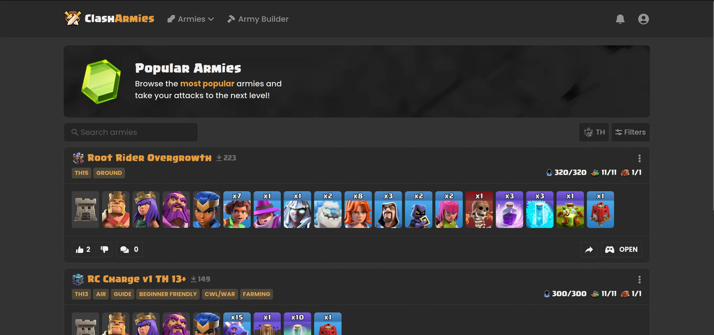
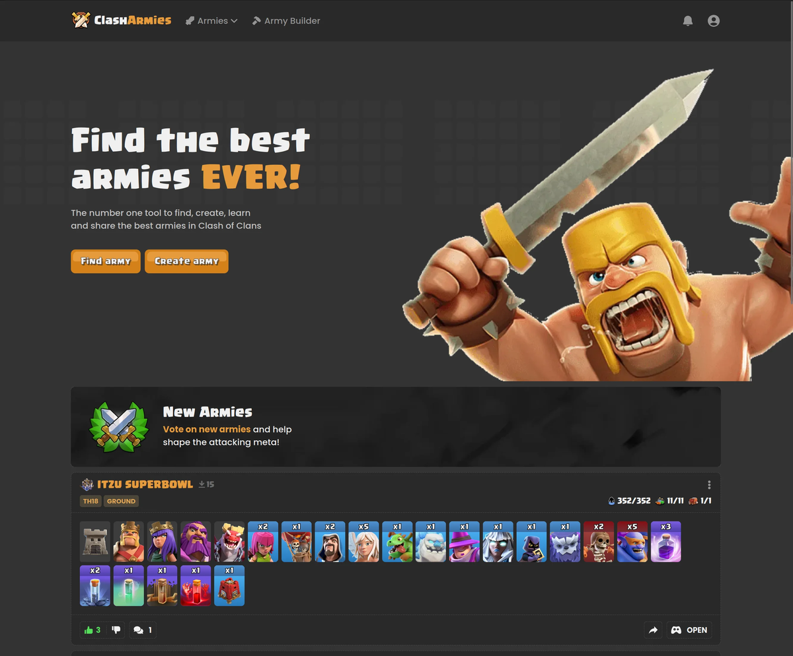
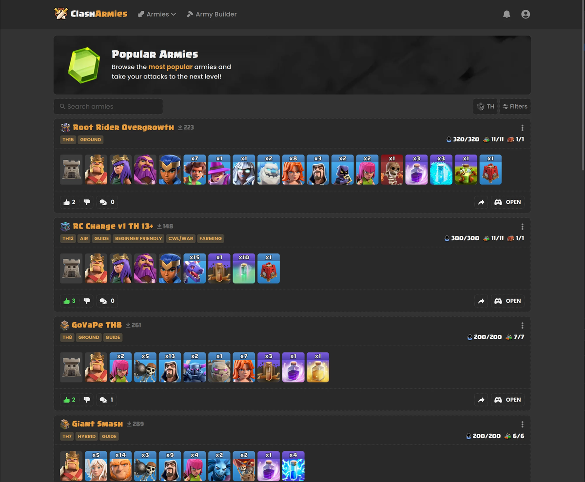
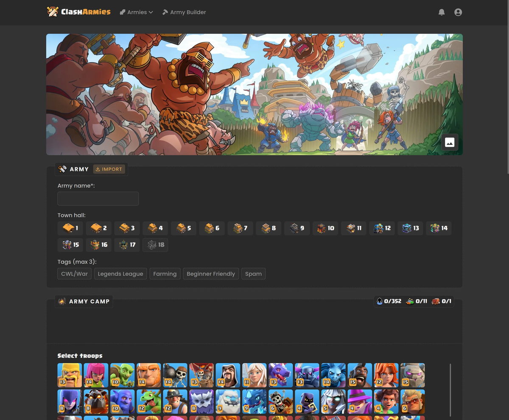
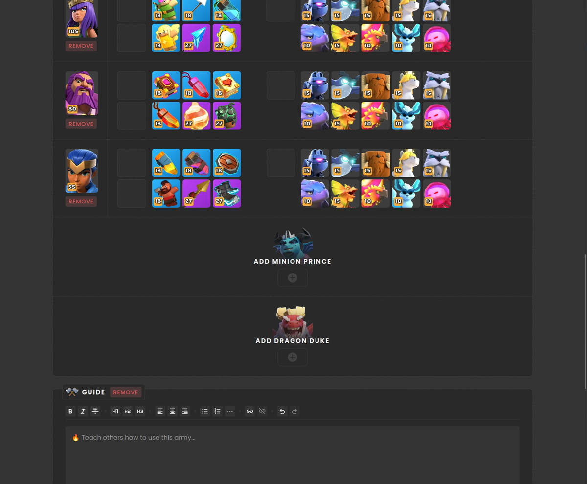
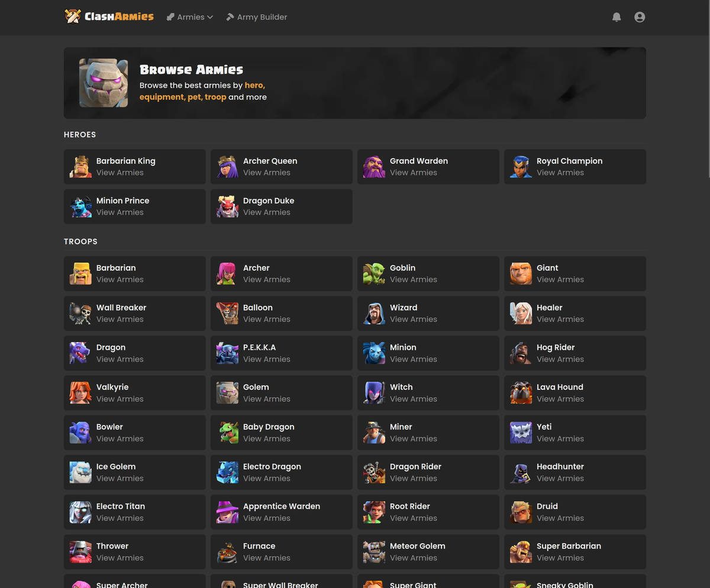
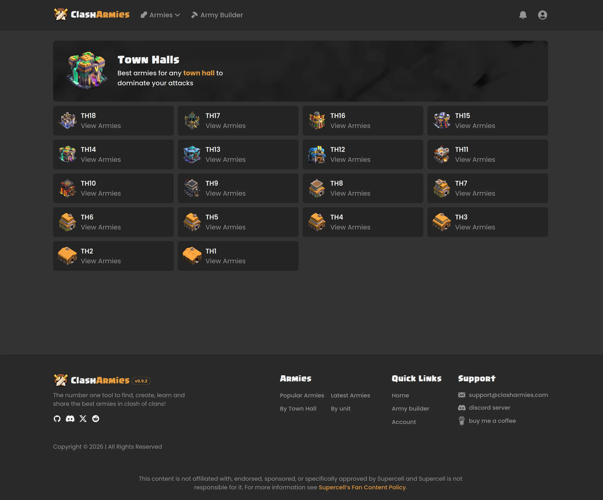
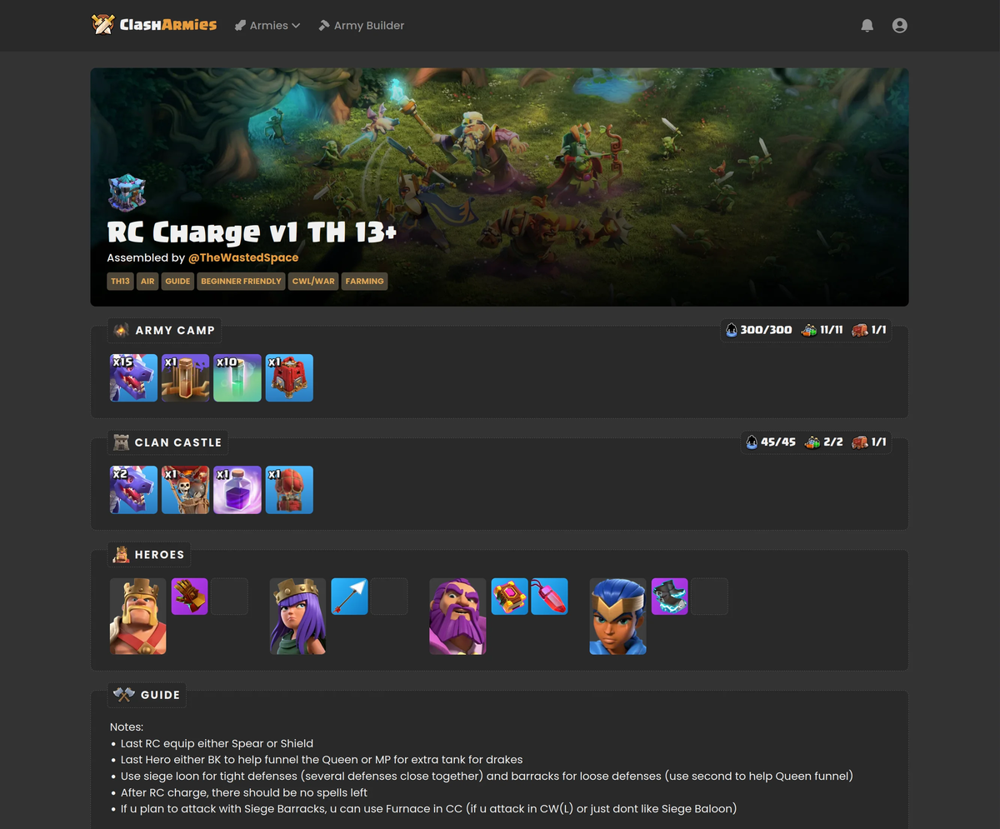
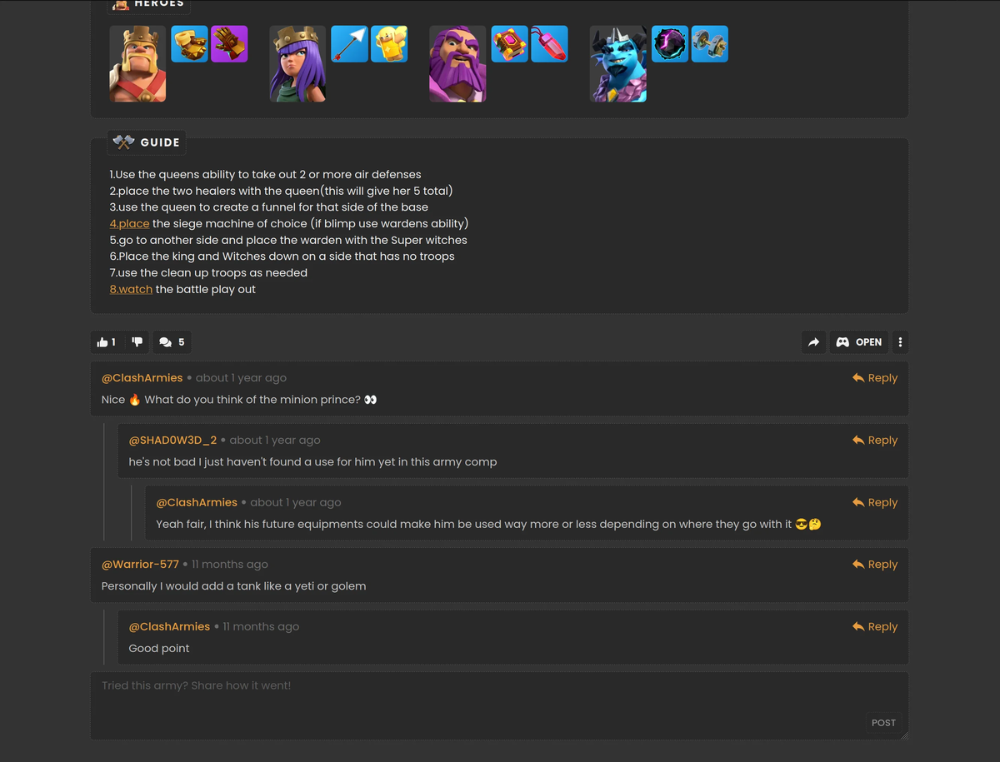
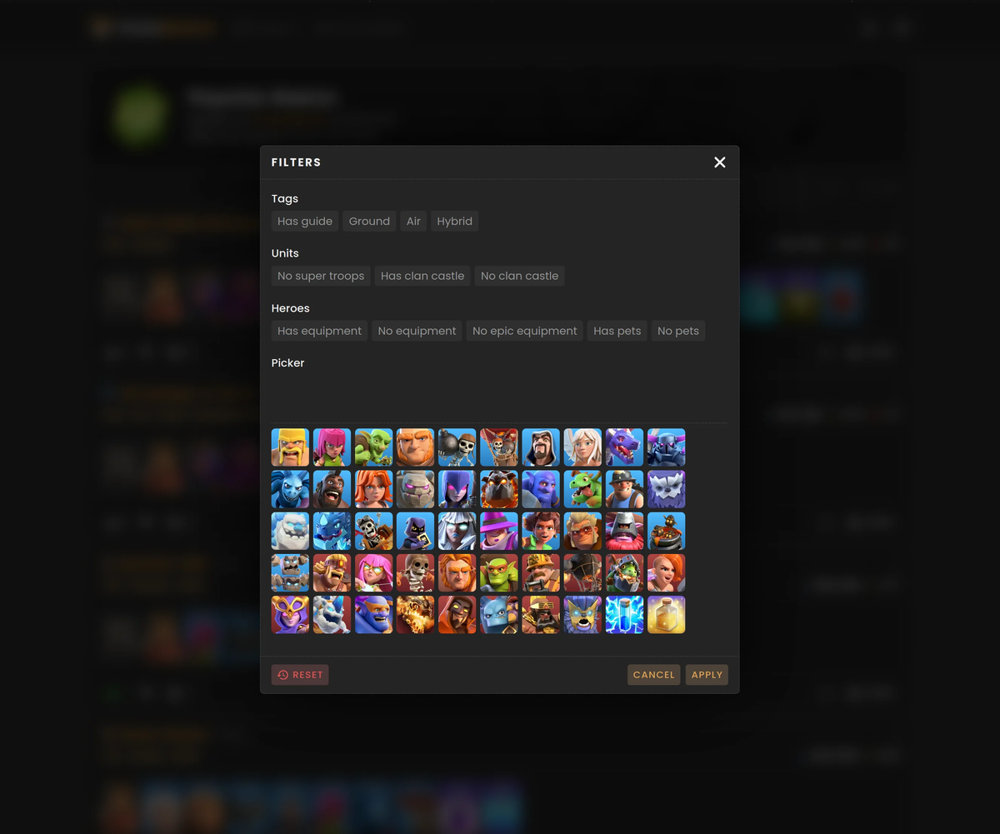

<h3 align="center">
  
  Clash Armies
</h3>

<p align="center">
  <a href="https://svelte.dev/docs/svelte/overview">
    
  </a>
  <a href="https://svelte.dev/docs/kit/introduction">
    
  </a>
  <a href="https://mariadb.org/">
    
  </a>
  <a href="https://www.docker.com/">
    
  </a>
  <a href="https://vite.dev/">
    
  </a>
  <a href="https://pnpm.io/">
    
  </a>
</p>

<p align="center">
    The number one tool to find, create and share the best armies in the game.
    <br />
    <a href="https://clasharmies.com">Live website</a>
    &middot;
    <a href="#screenshots">Screenshots</a>
    &middot;
    <a href="https://discord.gg/9wCmfXhZM6">Discord server</a>
</p>

<details>
  <summary>Table of contents</summary>
  <ol>
    <li>
      <a href="#about-the-project">About the project</a>
    </li>
    <li>
      <a href="#getting-started">Getting started</a>
      <ul>
        <li><a href="#prerequisites">Prerequisites</a></li>
        <li><a href="#installation">Installation</a></li>
      </ul>
    </li>
    <li><a href="#contributing">Contributing</a></li>
    <li><a href="#license">License</a></li>
    <li><a href="#contact">Contact</a></li>
    <li><a href="#acknowledgments">Acknowledgments</a></li>
  </ol>
</details>

## About the project

[](https://clasharmies.com/armies/popular)

<details id="screenshots">
  <summary>More screenshots</summary>

  <a href="https://clasharmies.com">
    
    Home page
  </a>
  <br />
  <br />

  <a href="https://clasharmies.com/armies/popular">
    
    Popular armies page
  </a>
  <br />
  <br />

  <a href="https://clasharmies.com/army-builder">
    
    Army builder page (details+units)
  </a>
  <br />
  <br />

  <a href="https://clasharmies.com/army-builder">
    
    Army builder page (heroes+guide)
  </a>
  <br />
  <br />

  <a href="https://clasharmies.com/armies/browse">
    
    Browse page
  </a>
  <br />
  <br />

  <a href="https://clasharmies.com/armies/town-halls">
    
    Town halls page
  </a>
  <br />
  <br />

  <a href="https://clasharmies.com/armies/406">
    
    Army page
  </a>
  <br />
  <br />

  <a href="https://clasharmies.com/armies/344#comments">
    
    Army page (comments)
  </a>
  <br />
  <br />

  <div>
    
    Armies filter popup
  </div>
</details>

<br />

Clash Armies is a (web) project that aims to make finding, learning and discussing Clash Of Clans armies as easy as possible. It also adds in social features such as voting and commenting to spark discussion between users.

- simple and convenient army viewer
  - easily copy an army link for sharing with others
  - open in game button which imports an army directly into Clash Of Clans
  - ability to vote on other users' armies and add/reply to comments
- interactive army builder for creating a full army (troops, spells, siege machines, clan castle, heroes, pets and equipment)
  - guide system allowing users to attach a formatted text or video guide describing exactly how to use an army
  - import from link feature allowing users to copy an army from in-game directly into the site
- various filterable pages and functionality to help make finding an army easy, such as:
  - new and popular armies
  - browse pages (find armies by a specific unit or town hall)
  - filtering by exact parameters (by tag, has guide, has no equipment, includes specific combination of troops, etc...)

Join the [discord server](https://discord.gg/9wCmfXhZM6) to keep up to date with discussions, sneak peaks and releases!

## Getting Started

If you need help running Clash Armies locally, or have suggestions on improving the dev workflow, give me a message on discord/github.

### Prerequisites

- `npm` >= 11.7.0
- `pnpm` >= 11.0.3
- `node` >= 26.3.0
- `docker` >= 29.1.3
- `docker compose` >= 5.1.3

### Installation

1. Clone the repo
   ```bash
   git clone https://github.com/NinjaInShade/clash-armies.git
   ```
2. Create and populate `.env`, following `.env.example` as a guide ([see here](#setting-up-google-oauth) for setting up Google oAuth env variables)
3. Install dependencies
   ```bash
   pnpm i
   ```
4. Start the app
   ```sh
   pnpm start
   ```

### Setting up Google oAuth

To be able to run the app and have authentication, you currently need to create a google oAuth project and generate a client id and secret which you place in your `.env` file.

Setting this up is totally free. These are the steps:

- Go to the [Google API dashboard](https://console.cloud.google.com/apis/dashboard)
- Go to `credentials` and create an oAuth client id/secret. In the setup wizard add `http://localhost:5173` as an authorized javascript origin, and `http://localhost:5173/api/login/google/callback` as an authorized redirect URI.
- Go to `oAuth consent screen` and customize the oAuth consent screen to your liking

### Running tests

Before running tests, you should create an `.env.test` file which largely can be the exact same as your `.env` file, but specifying a different `DB_PORT` is recommended.

You can run tests with the `pnpm run test` script, or `pnpm run test:coverage` which also generates a coverage report in `coverage/`.

Some users may enjoy the vitest visual web interface, which you can start and access via `pnpm run test:ui`.

## Contributing

Any contributions you make are **greatly appreciated**.

If you have a suggestion that would improve Clash Armies, don't hesitate to fork the repo and create a pull request. You can also open a github issue beforehand if you'd like to discuss anything.

## License

Distributed under the GNU General Public License version 3 (GPLv3) license. See [LICENSE](./LICENSE) for more information.

## Contact

- Email: support@clasharmies.com
- Discord: https://discord.gg/9wCmfXhZM6

## Acknowledgments

- [Clash API Developers discord](https://discord.gg/clashapi)
- [Official API](https://developer.clashofclans.com/#/)
- [ClashKing](https://github.com/ClashKingInc)
- [COC guide](https://coc.guide/)
